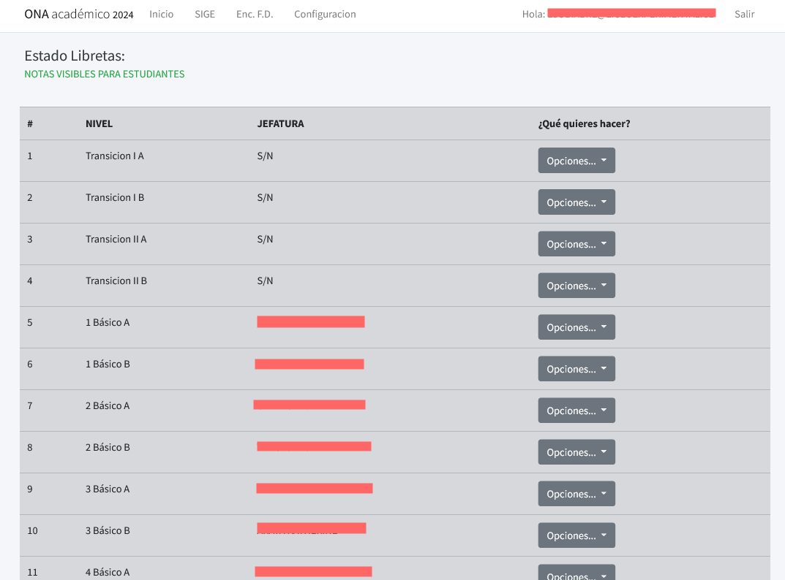

# App de gestión acádemica

Esta aplicación está diseñada para facilitar la gestión académica del establecimiento. Proporciona una plataforma para la administración de estudiantes, jefaturas y calificaciones. 

- Estado: finalizada y en producción.
- Fecha de inicio: 2013-actualidad
- Responsables: U.T.P.

## Características
>- Listado de cursos y sus jefaturas
>- Inscripción de alumnos en asignaturas
>- Ingreso de calificaciones
>- Imprimir calificaciones

## Screenshot

