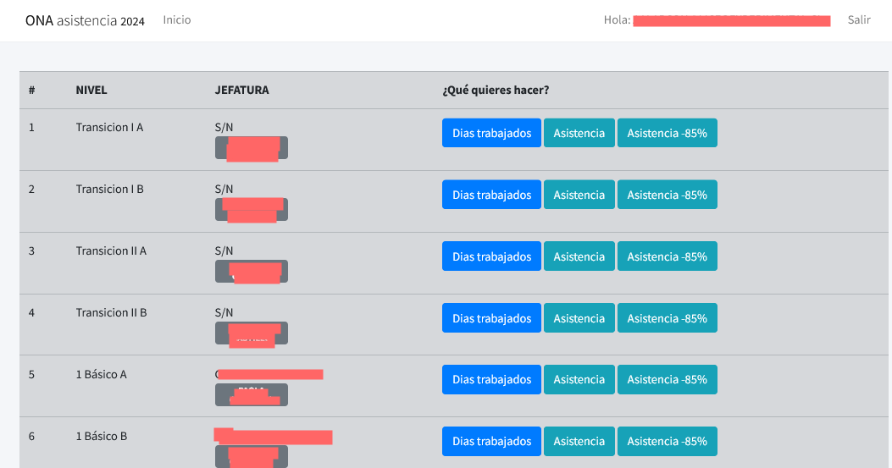

# App Asistencia

Esta aplicación fue diseñada para gestionar la asistencia de los estudiantes. Actualmente alimenta otras aplicaciones como el de apoderados, ficha de estudiante, profesor jefe y academemico para visualizar los porcentajes inferiores a 85%.

- Estado: finalizada y en producción.
- Fecha de inicio: 2022-actualidad
- Responsable: Inspectoría

## Características
>- Registro de dias trabajados
>- Registro de asistencia

## Screenshot

