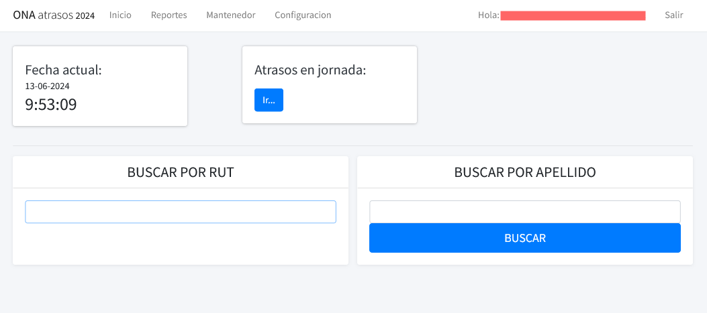

# App Atrasos

Esta aplicación fue diseñada para gestionar los atrasos de estudiantes. Registra atrasos en la plataforma que alimenta otros sistemas como el de apoderados, ficha de estudiante y profesor jefe.

- Estado: finalizada y en producción.
- Fecha de inicio: 2022-actualidad
- Responsable: Inspectoría

## Características
>- Registro de atrasos
>- Modificación de atrasos
>- Reporte de atrasos
>- Imprimir pase de estudiante atrasado

## Screenshot
